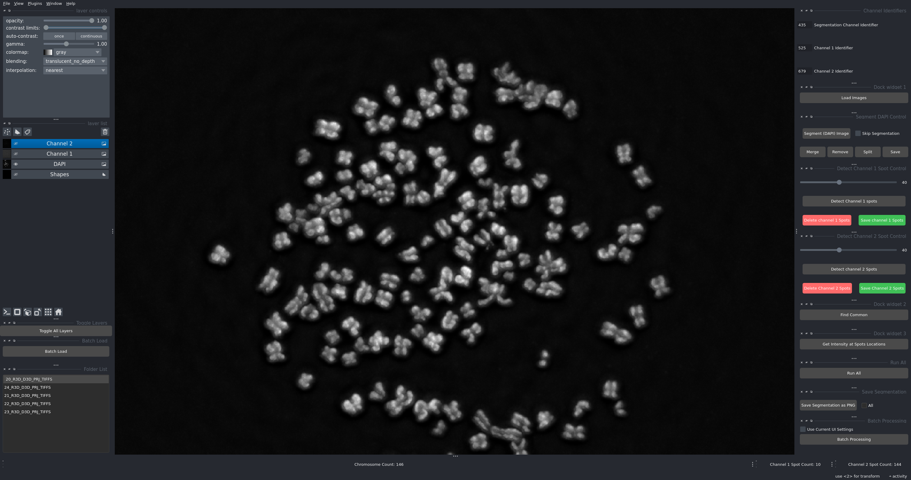
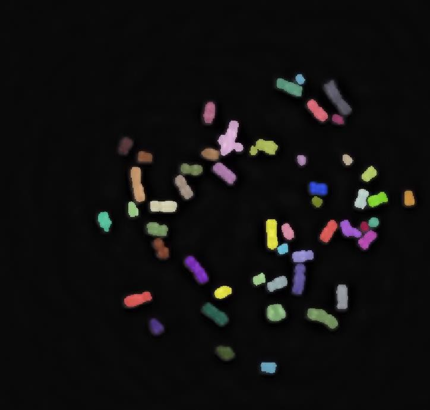
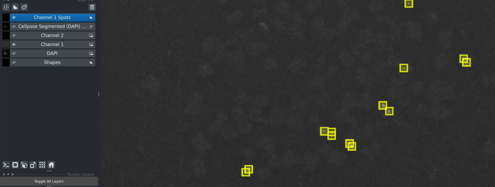
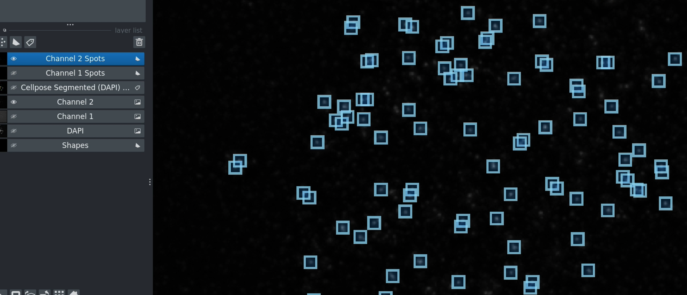

MetaChrome Documentation
========================

   The MetaChrome toolkit for chromosome analysis

An automatic deep learning toolkit for metaphase chromosome analysis, written in Python using Napari and Cellpose. It enables researchers to analyze multi-channel fluorescence microscopy images for chromosome segmentation, spot detection, and intensity quantification.

**Key Features:**

* **Automated Segmentation** - Cellpose-based chromosome detection
* **Multi-Channel Analysis** - DAPI, DNA-FISH, and CENP-C support
* **Spot Detection** - Adjustable threshold-based detection
* **Interactive Visualization** - Built on Napari platform
* **Batch Processing** - High-throughput analysis
* **Manual Corrections** - Interactive refinement tools

This toolkit integrates tools for detecting centromeres and measuring CENP-A levels within metaphase chromosome regions, enhancing the accuracy of chromosome analysis for researchers at the National Cancer Institute/NIH and beyond.

Contents
--------

.. toctree::
   :maxdepth: 2
   :caption: Introduction
   
   getting_started

.. toctree::
   :maxdepth: 2
   :caption: Tutorial
   
   installation
   tutorial
   quickstart

.. toctree::
   :maxdepth: 2
   :caption: User Guide
   
   workflow
   batch_processing
   manual_corrections
   advanced_features
   troubleshooting
   user_guide

.. toctree::
   :maxdepth: 2
   :caption: API Reference
   
   api
   modules

Quick Navigation
----------------

.. list-table::
   :widths: 40 60
   :header-rows: 1

   * - **I want to...**
     - **Go to...**
   * - Understand what this toolkit does
     - :doc:`getting_started`
   * - Install the software
     - :doc:`installation`
   * - Do my first analysis
     - :doc:`tutorial`
   * - Learn the complete workflow
     - :doc:`workflow`
   * - Process many images
     - :doc:`batch_processing`
   * - Fix detection errors
     - :doc:`manual_corrections`
   * - Optimize parameters
     - :doc:`advanced_features`
   * - Solve a problem
     - :doc:`troubleshooting`
   * - Use the API programmatically
     - :doc:`api`

Example Workflow
----------------

   Example of spot detection results

A typical analysis workflow:

1. **Configure** channel identifiers → 2. **Load** images → 3. **Segment** chromosomes → 4. **Detect** spots → 5. **Find** common regions → 6. **Measure** intensities → 7. **Export** results

See the :doc:`tutorial` for a step-by-step walkthrough.

Use Cases
---------

This toolkit is designed for researchers working on:

**Chromosome Structure Analysis**
   Quantitative assessment of metaphase chromosome morphology and organization.

**Centromere Studies**
   CENP-C localization, intensity measurements, and centromere protein analysis.

**DNA-FISH Analysis**
   Detection and quantification of specific DNA sequences in metaphase chromosomes.

**Signal Co-localization**
   Spatial relationships between different fluorescent markers on chromosomes.

**High-Throughput Screening**
   Automated analysis of large image datasets from screening experiments.

Image Requirements
------------------

**Required Channels:**

* **DAPI** - Chromosome/nuclear staining for segmentation
* **DNA-FISH** (Channel 1) - Specific DNA sequence detection
* **CENP-C** (Channel 2) - Centromere protein detection

**Supported Formats:**

TIFF (recommended), PNG, JPG

**File Naming:**

Images should contain identifiable strings (e.g., ``sample_001_w435.tif``, ``sample_001_w525.tif``, ``sample_001_w679.tif``)

Example Results
---------------

   Complete analysis showing detected spots in both channels

**Outputs:**

* Visual overlays (segmented chromosomes + detected spots)
* CSV files with coordinates and intensity measurements
* Summary statistics for batch-processed datasets
* Exportable images for presentations and publications

Performance
-----------

**Processing Speed:**

* Single image: ~30-60 seconds (with GPU)
* Batch of 100 images: ~1-2 hours (with GPU)

**Accuracy:**

* Chromosome segmentation: High accuracy with trained Cellpose models
* Spot detection: Adjustable sensitivity via threshold controls
* Manual correction: Interactive refinement for maximum accuracy

Citation
--------

If you use this toolkit in your research, please cite:

**Author:** Md Abdul Kader Sagar  
**Email:** sagarm2@nih.gov  
**Affiliation:** HITIF/LRBGE/CCR/NCI (National Cancer Institute/NIH)

License
-------

This project is developed at the National Cancer Institute/NIH.

Contact and Support
-------------------

**Questions or Issues?**

* **Email:** sagarm2@nih.gov
* **Institution:** National Cancer Institute/NIH

**Community Resources:**

* Napari Documentation: https://napari.org/
* Cellpose Documentation: https://cellpose.readthedocs.io/

Indices and Tables
==================

* :ref:`genindex`
* :ref:`modindex`
* :ref:`search`
