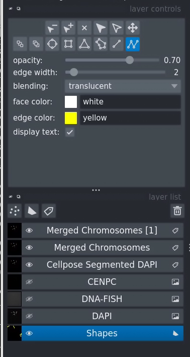
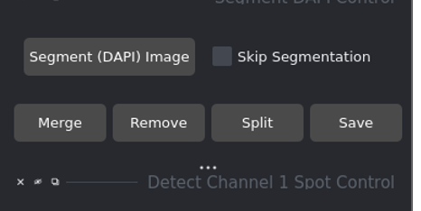
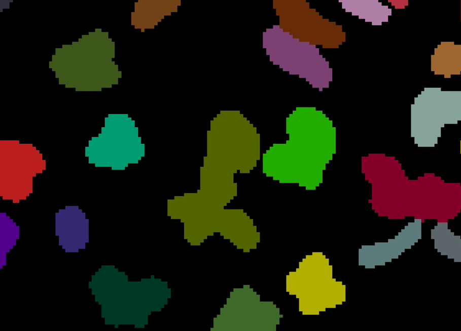
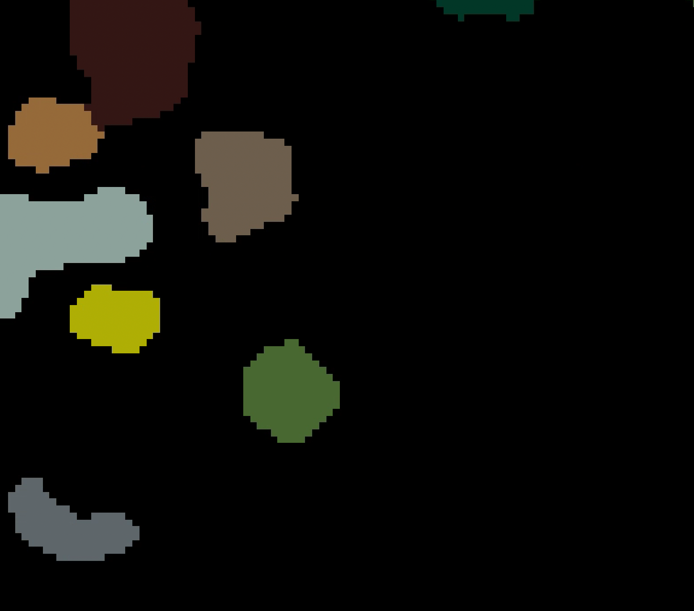
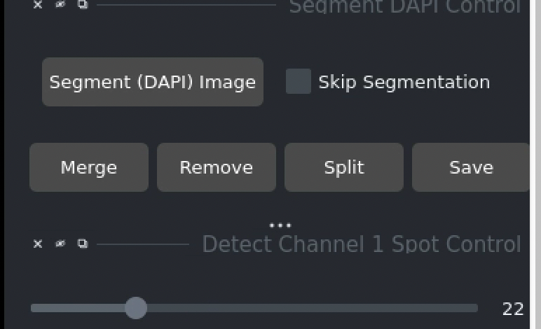
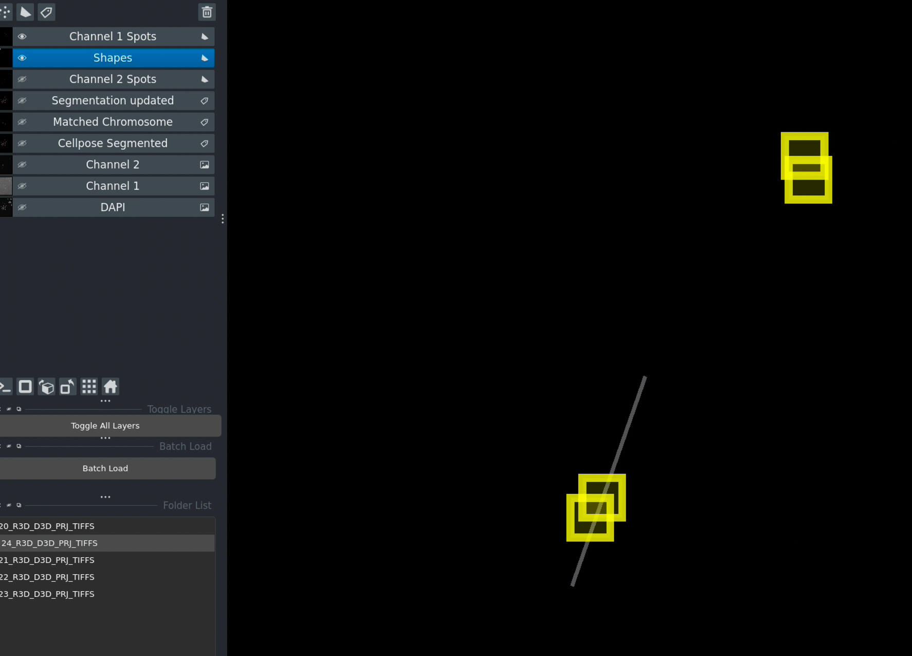
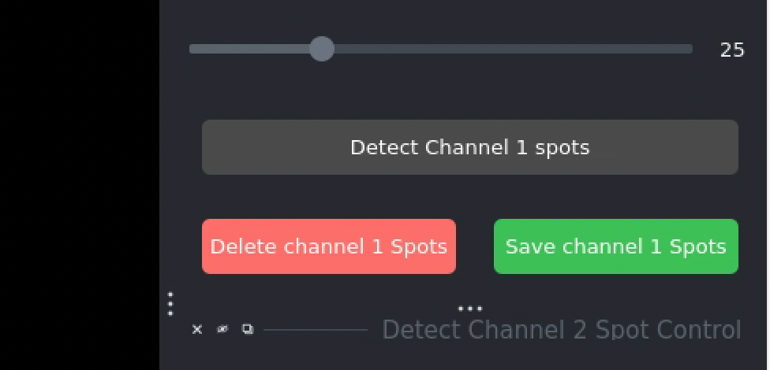
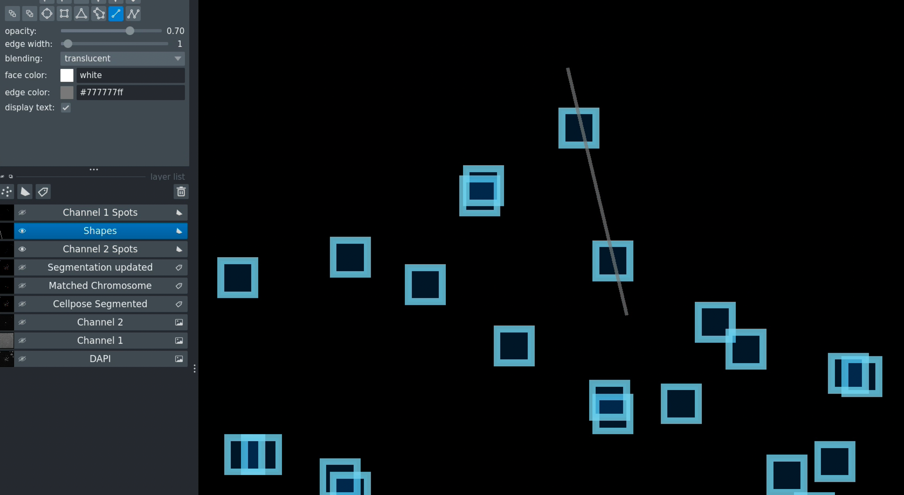
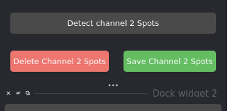

Manual Corrections
==================

Interactive tools for refining automated analysis results.

Overview
--------

While automated segmentation and spot detection are generally accurate, manual correction tools allow you to refine results for maximum accuracy. This is especially important for:

* Incorrectly split or merged chromosomes
* False positive spots
* Ambiguous segmentation boundaries
* Quality control and validation

The toolkit provides interactive drawing tools integrated with Napari for intuitive corrections.

Manual Correction Workflow
---------------------------

**When to Use Manual Corrections:**

✅ Segmentation errors (split/merged chromosomes)  
✅ False positive spots  
✅ Quality control for critical samples  
✅ Publication-quality analysis  

**Recommended Approach:**

1. Run automated analysis
2. Review results visually
3. Apply corrections where needed
4. Save corrections
5. Re-run intensity calculations

Merging Chromosomes
-------------------

Use when a single chromosome is incorrectly segmented into multiple regions.



   Drawing a line to connect regions that should be merged

Step-by-Step Process
~~~~~~~~~~~~~~~~~~~~~

**1. Prepare the Workspace**



   Ensure segmented layer and shapes layer are visible

* Make sure the **segmented layer** is visible (eye icon on)
* Make sure the **shapes layer** is visible
* Both layers should be shown simultaneously

**2. Select the Shapes Layer**

.. figure:: _static/images/slide_16_make_sure_the_segmented_layer__img16.png
   :alt: Select shapes layer
   :align: center
   :width: 75%

   Select the shapes layer before drawing

* Click on the **Shapes layer** in the layer list
* It should be highlighted/selected
* This ensures your drawings go to the correct layer

**3. Draw the Merge Line**

* Select the **Polygon/Line drawing tool** from the top toolbar
* Click on the first chromosome region you want to merge
* Continue drawing a line to the second region
* The line should cross both regions
* **Double-click** to finish drawing

.. tip::
   The line doesn't need to be straight - just make sure it touches both regions you want to merge.

**4. Execute the Merge**

Click the **Merge Chromosomes** button

**Result:**



   Result after merging - regions are now combined

* The two regions are combined into one
* They now share the same label/color
* The shapes layer drawing is removed
* Segmentation layer is updated

**5. Save Your Work**

Click **Save** to preserve the correction

.. important::
   Without saving, the merge will be lost when you load a different image or close the application.

Removing Chromosomes
---------------------

Use when you want to exclude specific chromosomes from analysis (e.g., edge chromosomes, debris, artifacts).

.. figure:: _static/images/slide_17_removing_chromosomes_draw_lin_img18.png
   :alt: Drawing removal line
   :align: center
   :width: 75%

   Drawing over a chromosome to mark it for removal

Step-by-Step Process
~~~~~~~~~~~~~~~~~~~~~

**1. Select the Shapes Layer**

* Click on the **Shapes layer** in the layer list
* Ensure it's highlighted/selected

**2. Draw Over the Chromosome**

* Select the **Polygon/Line drawing tool**
* Draw a line through the chromosome you want to remove
* The line must cross or cover part of the chromosome
* **Double-click** to finish

.. tip::
   You can draw multiple shapes to mark multiple chromosomes before clicking Remove.

**3. Execute the Removal**

Click the **Remove** button

**Result:**



   Updated segmentation excluding the removed chromosome

* The marked chromosome(s) are removed from the segmentation
* The label is set to 0 (background)
* Other chromosomes remain unchanged

**4. Save the Changes**



   Save your corrections

Click **Save** to store the updated segmentation

.. note::
   Saved corrections are loaded automatically next time you open this image set.

Deleting Spots
--------------

Use manual spot deletion to remove false positives from either channel.

Deleting Channel 1 Spots (DNA-FISH)
~~~~~~~~~~~~~~~~~~~~~~~~~~~~~~~~~~~~



   Draw shapes over spots to mark them for deletion

**Process:**

1. Select the **Shapes layer**
2. Draw shapes (rectangles, circles, or polygons) over spots you want to delete
3. The shape must overlap or cover the spot
4. Click **Delete Channel 1 Spots**

**Result:**



   Updated spot layer after deletion

* Spots intersecting with drawn shapes are removed
* The Channel 1 spots layer is updated
* Shape drawings are cleared

Deleting Channel 2 Spots (CENP-C)
~~~~~~~~~~~~~~~~~~~~~~~~~~~~~~~~~~



   Interface for deleting Channel 2 spots

Same process as Channel 1:

1. Select **Shapes layer**
2. Draw shapes over spots to delete
3. Click **Delete Channel 2 Spots**

**Result:**



   Channel 2 spots after manual correction

Multiple spots can be deleted at once by drawing multiple shapes or one large shape covering all targets.

**Save Spot Corrections:**

Click **Save** to preserve spot deletions

.. important::
   If you don't save:
   
   * Corrections are lost when switching images
   * Reloading the image will show original detected spots
   * Batch processing will use original detection

Drawing Tools and Tips
----------------------

Napari Drawing Tools
~~~~~~~~~~~~~~~~~~~~

**Available Tools:**

* **Rectangle**: Draw rectangular selection boxes
* **Ellipse**: Draw circular/elliptical selections
* **Polygon**: Draw freeform polygons
* **Line**: Draw straight or curved lines

**How to Use:**

1. Click the tool icon in the toolbar
2. Click and drag to draw
3. Double-click to finish (for polygon/line)
4. Press **Escape** to cancel

**Tool Shortcuts:**

* **Z**: Zoom tool
* **P**: Pan tool
* **Delete**: Remove selected shape
* **Ctrl/Cmd + Z**: Undo last action

Drawing Best Practices
~~~~~~~~~~~~~~~~~~~~~~~

**For Merging Chromosomes:**

* Draw a clear line connecting both regions
* Line should touch both chromosomes
* Doesn't need to be precise - just connect them
* Can be straight or curved

**For Removing Chromosomes:**

* Line must intersect the chromosome
* Can draw through multiple chromosomes for batch removal
* Partial overlap is sufficient

**For Deleting Spots:**

* Shape must overlap the spot
* Drawing a circle/rectangle around spots is easiest
* Can select multiple spots with one large shape
* Zoom in for precise selection

Common Drawing Issues
~~~~~~~~~~~~~~~~~~~~~

**Problem: Shapes appear on the wrong layer**

* **Solution**: Click the Shapes layer to select it before drawing

**Problem: Can't see the shapes I'm drawing**

* **Solution**: Toggle the shapes layer visibility (eye icon)

**Problem: Double-click doesn't finish the polygon**

* **Solution**: Try triple-clicking or pressing Enter

**Problem: Accidental shapes drawn**

* **Solution**: Select the shape and press Delete, or clear all with Clear Shapes button

Saving and Loading Corrections
-------------------------------

Saving Corrections
~~~~~~~~~~~~~~~~~~

Click the **Save** button after making any corrections.

**What Gets Saved:**

* Updated segmentation masks
* Modified spot labels
* Correction timestamps
* Original files remain unchanged

**File Locations:**

Corrections are saved as:

```
folder_name/
├── folder_name_segmentation_corrected.npy
├── folder_name_channel1_spots_corrected.npy
└── folder_name_channel2_spots_corrected.npy
```

Loading Previous Corrections
~~~~~~~~~~~~~~~~~~~~~~~~~~~~~

**Automatic Loading:**

When you load an image set that has saved corrections:

* Corrected segmentation loads automatically
* Corrected spot layers load automatically
* No need to re-apply corrections

**Verification:**

Check the console/terminal output:

```
Loading image set: sample_001
  - Found corrected segmentation: sample_001_segmentation_corrected.npy
  - Found corrected Channel 1 spots
  - Found corrected Channel 2 spots
  Loaded with corrections.
```

Reverting Corrections
~~~~~~~~~~~~~~~~~~~~~

To discard corrections and start over:

1. Delete the ``*_corrected.npy`` files
2. Reload the image set
3. Original automated results will load

Correction Workflow for Batch Processing
-----------------------------------------

When batch processing produces results that need correction:

**Approach 1: Pre-Correction (Recommended)**

1. Process a few representative images manually
2. Apply and save corrections
3. Run batch processing with "Use Saved Results"
4. Corrected versions will be used automatically

**Approach 2: Post-Correction**

1. Run batch processing on all images
2. Review results and identify images needing correction
3. Load problematic images individually
4. Apply and save corrections
5. Re-run analysis for those specific images

Best Practices
--------------

**When Making Corrections:**

1. ✅ Zoom in for better precision
2. ✅ Toggle layer visibility to see clearly
3. ✅ Save after each correction
4. ✅ Verify the correction worked before moving on
5. ✅ Document significant corrections

**Quality Control:**

* Review a random sample of automated results
* Focus corrections on critical samples
* Keep track of correction frequency (high frequency may indicate parameter issues)
* Consider adjusting thresholds if corrections are needed often

**Time Management:**

* Manual correction takes 1-5 minutes per image
* Reserve for important samples
* Use optimized automated parameters for most images
* Batch process first, then correct outliers

**Documentation:**

Keep notes on:

* Which images were corrected
* Type of corrections made
* Reasons for corrections
* Any systematic issues observed

Limitations and Considerations
-------------------------------

**Subjectivity:**

* Manual corrections introduce subjective judgment
* Different users may correct differently
* Establish clear criteria for corrections
* Consider inter-user validation for publications

**Time Investment:**

* Manual correction is time-consuming
* Not practical for very large datasets
* Reserve for critical samples
* Prefer parameter optimization over extensive corrections

**Reproducibility:**

* Automated methods are more reproducible
* Document all manual corrections
* Save correction files with results
* Include correction information in methods sections

Next Steps
----------

* :doc:`workflow` - Complete analysis workflow
* :doc:`batch_processing` - Process multiple images
* :doc:`advanced_features` - Additional features
* :doc:`troubleshooting` - Common issues and solutions

