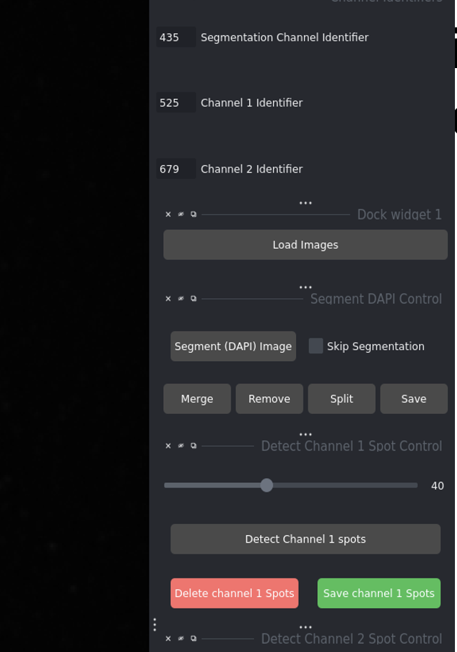
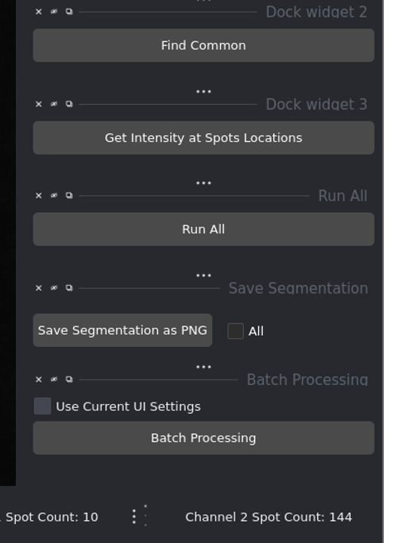
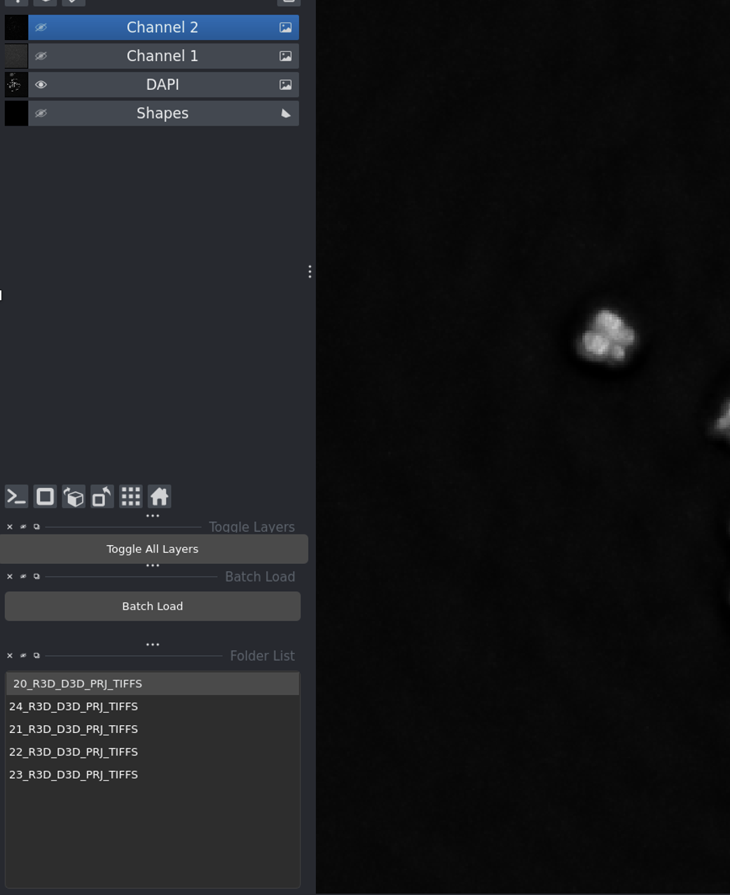
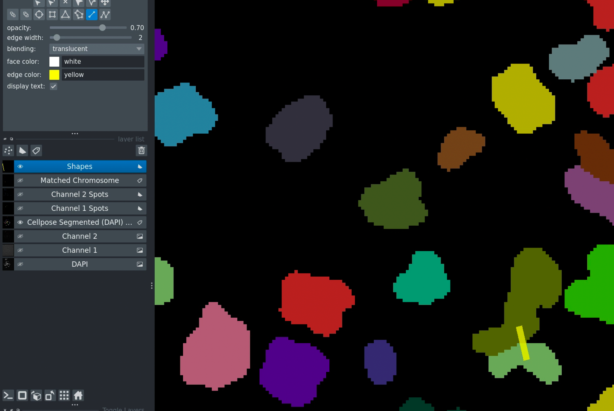
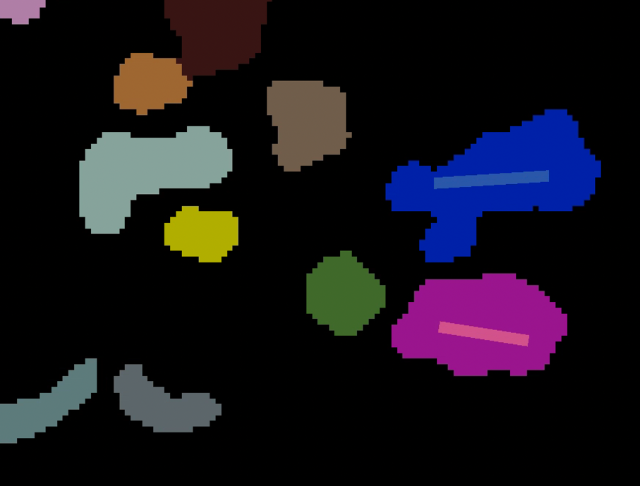

Tutorial
========

This tutorial will guide you through a complete chromosome analysis with MetaChrome. You'll learn all the steps from launching the application to exporting your results.

Prerequisites
-------------

Before starting, ensure you have:

* Python 3.8+ installed
* All dependencies installed (see :doc:`installation`)
* Sample chromosome images in TIFF format
* Trained Cellpose model (if using custom segmentation)

Launch the Application
----------------------

Start the application from the command line::

    python main.py

The Napari viewer window will open with the chromosome analysis interface.

Complete Analysis Workflow
---------------------------

Step 1: Configure Channel Identifiers
~~~~~~~~~~~~~~~~~~~~~~~~~~~~~~~~~~~~~~

Before loading images, set up your channel identifiers to match your image naming:

   **Configure your channel identifiers** (e.g., 435 for DAPI, 525 for DNA-FISH, 679 for CENP-C)

* **DAPI Channel**: Identifier in your DAPI image filenames
* **Channel 1 (DNA-FISH)**: Identifier for DNA-FISH images
* **Channel 2 (CENP-C)**: Identifier for CENP-C images

Step 2: Load Your Images
~~~~~~~~~~~~~~~~~~~~~~~~~

1. Click **Load Images**
2. Select the folder containing your image files
3. Your images will appear in the viewer and the folder list

.. figure:: _static/images/slide_04_step_2_loading_images_click_l_img04.png
   :alt: Loading images
   :align: center
   :width: 80%

   **After loading images** - the interface shows all available image sets in the list.

Step 3: Segment and Detect
~~~~~~~~~~~~~~~~~~~~~~~~~~~

For a complete analysis:

1. Click **Segment (DAPI) Image** to identify chromosomes
2. Adjust the **DNA-FISH Threshold** slider
3. Click **Detect Channel 1 Spots**
4. Adjust the **CENP-C Threshold** slider
5. Click **Detect Channel 2 Spots**

.. figure:: _static/images/slide_06_slide_6_img06.jpg
   :alt: Segmentation result
   :align: center
   :width: 75%

   **Segmentation result** showing individual chromosomes labeled with different colors.

.. figure:: _static/images/slide_08_after_clicking_detect_channel__img08.png
   :alt: Spot detection result
   :align: center
   :width: 75%

   **Spot detection** - brown markers show detected DNA-FISH spots.

.. tip::
   If you don't need chromosome segmentation, check **Skip Segmentation** before loading images.

Step 4: Find Common Regions
~~~~~~~~~~~~~~~~~~~~~~~~~~~~

Click **Find Common** to identify regions where both DNA-FISH and CENP-C signals overlap.

This step filters the data to only include meaningful co-localized signals.

Step 5: Get Results
~~~~~~~~~~~~~~~~~~~~

Click **Get Intensity at Spots Location** to:

* Calculate intensities at all detected spots
* Export results as a CSV file
* Save data in the same folder as your images

Done! Your analysis is complete and results are saved.

Quick Workflow Using "Run All"
-------------------------------

For even faster processing:

1. Configure channel identifiers
2. Load images
3. Adjust both threshold sliders to optimal values
4. Click **Run All**

   **Run All** automates the entire workflow with one click.

The software will automatically execute all steps and export results.

Batch Processing Multiple Images
---------------------------------

To process many image folders at once:

1. Load multiple folders using **Load Images**
2. All folders appear in the list on the left
3. Set your optimal thresholds
4. Check **Use Current UI Settings**
5. Click **Batch Processing**

.. figure:: _static/images/slide_14_batch_processing_this_feature_img13.png
   :alt: Batch processing
   :align: center
   :width: 70%

   **Batch processing** interface for analyzing multiple image sets.

Results will be saved for each folder, plus a combined summary file.

Understanding the Interface
---------------------------

.. figure:: _static/images/slide_02_the_interface_img02.png
   :alt: Main interface
   :align: center
   :width: 85%

   **The main interface** showing all control panels.

**Key Components:**

* **Left panel**: Folder list and loaded image layers
* **Right panel**: Control widgets and buttons
* **Center**: Napari viewer displaying your images
* **Top toolbar**: Napari tools for zooming, panning, and drawing

Viewing Your Data
~~~~~~~~~~~~~~~~~

   **Layer visibility controls** - click the eye icon to show/hide channels.

* Click the **eye icon** to toggle layer visibility
* Adjust **contrast** and **brightness** for each layer
* Use **Toggle All Layers** to show/hide everything at once

Manual Corrections (Optional)
------------------------------

Merging Chromosomes
~~~~~~~~~~~~~~~~~~~

If two chromosome regions should be one:

1. Select the **Shapes layer**
2. Draw a line connecting the regions
3. Click **Merge Chromosomes**

   **Merging chromosomes** - draw a line to connect regions that should be merged.

Removing Chromosomes
~~~~~~~~~~~~~~~~~~~~

To delete unwanted chromosomes:

1. Select the **Shapes layer**
2. Draw a line through the chromosome
3. Click **Remove**

   **Removing chromosomes** - draw over regions to mark for deletion.

Don't forget to click **Save** after making manual corrections!

Example Workflow Summary
------------------------

**Single Image Analysis:**

.. code-block:: text

   Configure channels → Load images → Segment → Detect spots → 
   Find common → Get intensities → Save

**Batch Processing:**

.. code-block:: text

   Configure channels → Load all folders → Set thresholds → 
   Batch Processing → Results saved automatically

**With Manual Corrections:**

.. code-block:: text

   Follow single image workflow → Make corrections → Save → 
   Continue with next image

Tips for Best Results
---------------------

**Threshold Adjustment:**

* Start with mid-range values (around 50)
* Lower threshold = more spots detected (more sensitive)
* Higher threshold = fewer spots (more specific)
* Optimize on a test image before batch processing

**Image Quality:**

* Use well-focused images with good contrast
* Ensure consistent imaging parameters across samples
* Check that all three channels are properly aligned

**Consistent Naming:**

* Use the same identifier pattern for all images
* Example: ``sample001_435.tif``, ``sample001_525.tif``, ``sample001_679.tif``
* Identifiers can appear anywhere in the filename

**Performance:**

* Enable GPU for faster Cellpose segmentation
* Process similar images in batches
* Close other applications if memory is limited

Common Issues
-------------

**No spots detected:**

* Lower the detection threshold
* Check that images are properly loaded
* Verify channel identifiers match your filenames

**Too many false positives:**

* Increase the detection threshold
* Check image quality and background

**Segmentation errors:**

* Verify DAPI image quality
* Use manual correction tools
* Check that chromosomes are well-separated

**Images won't load:**

* Verify file naming matches your identifiers
* Check that files are in supported formats (TIFF, PNG, JPG)
* Ensure all three channels are present (or use Skip Segmentation)

Next Steps
----------

* Read the complete :doc:`user_guide` for detailed feature descriptions
* Check the :doc:`api` documentation for programmatic usage
* Review :doc:`installation` for GPU setup and optimization

**Need Help?**

Contact: sagarm2@nih.gov (HITIF/LRBGE/CCR/NCI)
