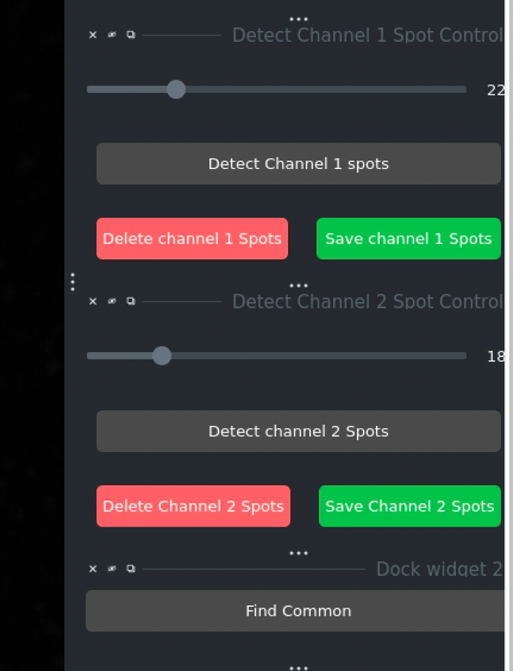

User Guide
==========

This comprehensive manual covers all features of the Napari Chromosome Analysis toolkit.

.. note::
   **Author:** Md Abdul Kader Sagar  
   **Affiliation:** HITIF/LRBGE/CCR/NCI

Overview
--------

The Napari Chromosome Analysis toolkit is designed for analyzing metaphase chromosomes using advanced image processing techniques. It provides tools for:

* Automated chromosome segmentation using Cellpose
* Multi-channel fluorescence image analysis
* Spot detection for DNA-FISH and CENP-C signals
* Quantitative intensity measurements
* Batch processing capabilities
* Interactive manual correction tools

The Interface
-------------

The interface consists of several interactive widgets and buttons, organized as follows:

.. figure:: _static/images/slide_02_the_interface_img02.png
   :alt: Main interface of the Napari Chromosome Analysis tool
   :align: center
   :width: 85%

   **Figure 1:** The main interface showing all control panels and the napari viewer.

**Main Components:**

* **Channel Identifiers**: Text inputs to specify identifiers for DAPI, DNA-FISH, and CENP-C channels
* **Load Images**: Button to select a folder containing images
* **Segment DAPI Control**: Allows segmenting the DAPI image and/or choosing to skip segmentation if needed
* **Spot Detection Controls**: Adjustable sliders for setting detection thresholds for Channel 1 (DNA-FISH) and Channel 2 (CENP-C)
* **Shapes Layer**: A layer to draw lines for manual adjustments like merging or removing chromosomes

Step-by-Step Workflow
----------------------

Step 1: Setting Up Channel Identifiers
~~~~~~~~~~~~~~~~~~~~~~~~~~~~~~~~~~~~~~~

Before loading images, you must define the channel identifiers that match your image naming convention:

**Channel Identifiers:**

* **DAPI Channel Identifier**: Enter the identifier used for DAPI channel images. For example, ``435`` if your images are named like ``R3D_D3D_PRJ_w435.tif``
* **Channel 1 Identifier**: Enter the identifier used for DNA-FISH channel images (e.g., ``525``)
* **Channel 2 Identifier**: Enter the identifier used for CENP-C channel images (e.g., ``679``)

**Alternative Naming:**

You can also use descriptive identifiers:

* DAPI: ``dapi``
* DNA-FISH: ``dna_fish``
* CENP-C: ``cenpc``

.. note::
   The identifier can appear anywhere in the filename. For example, ``sample_435_channel.tif`` or ``w435.tif`` will both match the identifier ``435``.

.. figure:: _static/images/slide_03_workflow_guide_step_1_setting_img03.png
   :alt: Channel identifier configuration panel
   :align: center
   :width: 75%

   **Figure 2:** Setting up channel identifiers before loading images.

Step 2: Loading Images
~~~~~~~~~~~~~~~~~~~~~~

1. Click the **Load Images** button
2. A file dialog will open - navigate to the folder containing your images
3. Click **Select** to load the images
4. Notice the left-bottom corner: all folders with images will appear as a list
5. Click any item in the list to load all 3 channels for that image set

.. figure:: _static/images/slide_04_step_2_loading_images_click_l_img04.png
   :alt: Image loading interface
   :align: center
   :width: 85%

   **Figure 3:** The interface after loading images, showing the folder list and loaded channels.

.. tip::
   If you selected **Skip Segmentation**, the DAPI image will not be segmented, and spot detection will proceed directly on the other channels.

Understanding the Napari Viewer
~~~~~~~~~~~~~~~~~~~~~~~~~~~~~~~~

After loading images, all 3 channels are visible in the napari viewer:

.. figure:: _static/images/slide_05_this_is_how_napari_works._all__img05.png
   :alt: Napari layer controls
   :align: center
   :width: 80%

   **Figure 4:** Napari viewer showing all channels and layer controls.

**Layer Controls:**

* Click the **eye icon** next to any layer to show/hide that channel
* Use **Toggle All Layers** to show/hide all layers at once
* Adjust brightness and contrast for each layer individually
* Layers list appears on the left side of the viewer

Step 3: Segmenting DAPI Image
~~~~~~~~~~~~~~~~~~~~~~~~~~~~~~

The DAPI segmentation step identifies individual chromosomes using a trained Cellpose model.

1. Click **Segment (DAPI) Image**
2. The software will process the DAPI channel
3. A new labels layer called "Cellpose Segmented DAPI" will appear in the viewer
4. Each chromosome is assigned a unique label/color

.. figure:: _static/images/slide_06_slide_6_img06.jpg
   :alt: Segmentation output
   :align: center
   :width: 80%

   **Figure 5:** Output of chromosome segmentation showing individual chromosomes labeled with different colors.

.. note::
   If you want to skip segmentation, check the **Skip Segmentation** checkbox before loading images. This is useful when:
   
   * You don't have DAPI images
   * You only want to analyze DNA-FISH and CENP-C channels
   * Chromosomes are not needed for your analysis

Step 4: Adjusting Spot Detection Thresholds
~~~~~~~~~~~~~~~~~~~~~~~~~~~~~~~~~~~~~~~~~~~~

Before detecting spots, adjust the threshold values to optimize detection sensitivity:

**DNA-FISH Threshold Slider:**
   * Range: 0-100 (displayed as 0.0-1.0 internally)
   * Lower value = more sensitive (detects more spots, including potential noise)
   * Higher value = more selective (detects only bright spots)

**CENP-C Threshold Slider:**
   * Same range and behavior as DNA-FISH
   * Optimize based on your image's signal-to-noise ratio

.. figure:: _static/images/slide_07_step_4:_adjusting_spot_detecti_img07.png
   :alt: Threshold adjustment sliders
   :align: center
   :width: 70%

   **Figure 6:** Spot detection threshold sliders for both channels.

.. important::
   Changing the slider resets the spot detection status, requiring you to re-run the spot detection process.

Step 5: Detecting Spots
~~~~~~~~~~~~~~~~~~~~~~~~

After setting appropriate thresholds:

1. Click **Detect Channel 1 Spots** to identify spots in the DNA-FISH image
2. Click **Detect Channel 2 Spots** for the CENP-C image
3. Detected spots will be displayed as labels in the napari viewer

.. figure:: _static/images/slide_08_after_clicking_detect_channel__img08.png
   :alt: Channel 1 spot detection result
   :align: center
   :width: 80%

   **Figure 7:** After clicking "Detect Channel 1 Spots" - a new layer shows detected spots as brown markers.

**Viewing Detected Spots:**

* A new layer "Channel 1 spots" appears for DNA-FISH
* Brown/colored markers indicate detected spot locations
* Toggle the DNA-FISH channel visibility to see how spots overlay with the signal

.. figure:: _static/images/slide_09_do_the_same_for_channel_2_and__img09.png
   :alt: Channel 2 spot detection result
   :align: center
   :width: 80%

   **Figure 8:** Both channels showing detected spots after processing Channel 2.

.. tip::
   If you already ran spot detection and want to redo it:
   
   1. Adjust the threshold slider (even slightly)
   2. Click the detection button again

Step 6: Finding Common Chromosomes
~~~~~~~~~~~~~~~~~~~~~~~~~~~~~~~~~~~

This step identifies chromosomes where both DNA-FISH and CENP-C signals are present:

1. Click **Find Common**
2. The software identifies matching regions between both channels
3. Common labels are overlaid, highlighting areas where both signals co-localize

.. figure:: _static/images/slide_10_step_6:_finding_common_chromos_img10.png
   :alt: Finding common regions interface
   :align: center
   :width: 75%

   **Figure 9:** Interface for finding common regions between channels.

   **Figure 10:** Visualization of common regions where both signals overlap.

This step is crucial for:

* Filtering out background noise
* Ensuring both signals are present in the analysis region
* Improving measurement accuracy

Step 7: Calculating Intensity and Exporting Results
~~~~~~~~~~~~~~~~~~~~~~~~~~~~~~~~~~~~~~~~~~~~~~~~~~~~

The final analysis step measures signal intensities at spot locations:

1. Click **Get Intensity at Spots Location**
2. The software calculates:
   
   * Channel 2 intensity at Channel 1 spot locations
   * Channel 1 intensity at Channel 2 spot locations

3. A CSV file is automatically saved in the same folder as your images
4. Filename format: ``<folder_name>_intensity.csv``

**Locating Your Results:**

Check the terminal window to see where the file is being saved.

**CSV File Contents:**

The exported CSV contains:

* Spot coordinates (X, Y)
* Intensity values for both channels
* Metadata (folder name, parameters used)

Analysis Without Segmentation
------------------------------

For cases where chromosome segmentation is not needed:

**When to Use:**

* No DAPI images available
* Only interested in DNA-FISH and CENP-C co-localization
* Analyzing entire image without chromosome boundaries

**How to Use:**

1. Check **Skip Segmentation** before loading images
2. Load only DNA-FISH and CENP-C channels (DAPI is ignored even if present)
3. Follow Steps 4-7 normally (spot detection, finding common regions, intensity calculation)

**Analysis Approach:**

* Intensity is calculated at DNA-FISH spots from the CENP-C channel
* No chromosome boundaries are used
* Everything else remains the same

Automated Analysis
------------------

Run All
~~~~~~~

The **Run All** button automates the entire workflow:

1. Check/uncheck **Skip Segmentation** as per your requirement
2. Adjust threshold sliders to desired values
3. Click **Run All**

The software will automatically execute:

* Segmentation (if not skipped)
* Channel 1 spot detection
* Channel 2 spot detection
* Find common regions
* Calculate and export intensities

.. figure:: _static/images/slide_13_run_all_img12.png
   :alt: Run All button
   :align: center
   :width: 60%

   **Figure 11:** The "Run All" button for automated processing.

.. tip::
   Use "Run All" when you've established optimal thresholds and want to quickly process individual images.

Batch Processing
~~~~~~~~~~~~~~~~

For processing multiple image folders with consistent settings:

.. figure:: _static/images/slide_14_batch_processing_this_feature_img13.png
   :alt: Batch processing interface
   :align: center
   :width: 75%

   **Figure 12:** Batch processing controls for analyzing multiple image sets.

**How Batch Processing Works:**

1. Load all folders using the folder list on the left
2. Configure your settings (thresholds, segmentation options)
3. Choose your processing mode:

   * **Use Current UI Settings** (checked): Recalculates everything from scratch using the same thresholds for every image
   * **Use Current UI Settings** (unchecked): Uses previously saved settings for each image folder

4. Click **Batch Processing**

**Output:**

* Individual CSV files saved in each image folder
* Summary CSV file created in the root directory
* Consolidated results for all processed images

.. note::
   Batch processing goes through all opened files in the list view and calculates necessary intensity measurements for each.

Manual Correction Tools
-----------------------

Step 8: Merging Chromosomes
~~~~~~~~~~~~~~~~~~~~~~~~~~~~

When segmentation incorrectly separates a single chromosome into multiple regions:

**Procedure:**

1. Select the **Shapes layer** from the layer list (lower left corner)
2. Select the **Polygon/Draw tool** from the top toolbar (marked with a pencil icon)
3. Draw a line connecting the chromosome regions you want to merge:
   
   * Click on the first segmented chromosome
   * Continue drawing the line over to the second chromosome
   * Double-click to finish drawing

4. Click **Merge Chromosomes**

.. figure:: _static/images/slide_15_step_8_merging_chromosomes_i_img14.png
   :alt: Drawing merge line
   :align: center
   :width: 75%

   **Figure 13:** Drawing a line to indicate chromosomes to merge.

**Important Steps:**

.. figure:: _static/images/slide_16_make_sure_the_segmented_layer__img15.png
   :alt: Layer visibility before merging
   :align: center
   :width: 75%

   **Figure 14:** Make sure both the segmented layer and shapes layer are visible.

.. figure:: _static/images/slide_16_make_sure_the_segmented_layer__img16.png
   :alt: Selecting shapes layer
   :align: center
   :width: 75%

   **Figure 15:** Ensure the shapes layer is selected when drawing.

.. figure:: _static/images/slide_16_make_sure_the_segmented_layer__img17.png
   :alt: After merging
   :align: center
   :width: 75%

   **Figure 16:** Result after clicking "Merge Chromosomes" - the regions are now combined.

Removing Chromosomes
~~~~~~~~~~~~~~~~~~~~

To delete unwanted chromosomes from the analysis:

**Procedure:**

1. Select the **Shapes layer**
2. Draw a line through the chromosome you want to remove
3. Click **Remove**

.. figure:: _static/images/slide_17_removing_chromosomes_draw_lin_img18.png
   :alt: Drawing line to remove chromosome
   :align: center
   :width: 75%

   **Figure 17:** Drawing over a chromosome to mark it for removal.

**Result:**

.. figure:: _static/images/slide_18_the_updated_chromosomes_layers_img19.png
   :alt: After chromosome removal
   :align: center
   :width: 75%

   **Figure 18:** The updated chromosome layer excluding the removed chromosome.

Saving Manual Corrections
~~~~~~~~~~~~~~~~~~~~~~~~~~

After making manual corrections:

1. Click **Save** in the interface
2. Your corrections are stored
3. Next time you load this image set, it will use the updated segmentation

.. figure:: _static/images/slide_19_slide_19_img20.png
   :alt: Save button
   :align: center
   :width: 60%

   **Figure 19:** Save your work to preserve manual corrections.

Updating Spot Detection
~~~~~~~~~~~~~~~~~~~~~~~

You can also manually correct spot detections:

**Deleting Channel 1 Spots:**

1. Select the **Shapes layer**
2. Draw shapes (squares or polygons) over spots you want to delete
3. Click **Delete Channel 1 Spots**
4. The spots layer will be updated

.. figure:: _static/images/slide_20_updating_segmentation_img21.png
   :alt: Drawing shapes over spots to delete
   :align: center
   :width: 75%

   **Figure 20:** Drawing shapes to mark spots for deletion.

.. figure:: _static/images/slide_20_updating_segmentation_img22.png
   :alt: After spot deletion
   :align: center
   :width: 75%

   **Figure 21:** Updated spot layer after deletion.

**Deleting Channel 2 Spots:**

The same process applies to Channel 2:

.. figure:: _static/images/slide_21_slide_21_img23.png
   :alt: Channel 2 spot deletion interface
   :align: center
   :width: 75%

   **Figure 22:** Interface for deleting Channel 2 spots.

.. figure:: _static/images/slide_21_you_can_delete_channel_2_spots_img24.png
   :alt: Channel 2 spots after deletion
   :align: center
   :width: 75%

   **Figure 23:** Updated Channel 2 spots after manual correction.

.. important::
   * Make sure the shapes layer is selected when drawing
   * Click **Save** to keep your spot corrections
   * Without saving, the software will use default detected spots when you reload

Data Export and Saving
----------------------

Saving Results
~~~~~~~~~~~~~~

**Processed Images:**

* All visualizations (segmented images, detected spots) remain in the napari viewer
* Use napari's export options: **File → Save Selected Layer(s)**
* Export individual layers as PNG or TIFF

**Intensity Data:**

* CSV files with intensity data are saved automatically
* Location: Same folder as the analyzed images
* Filename: ``<folder_name>_intensity.csv``

**Exporting Specific Layers:**

1. Select the layer you want to export
2. Navigate to **File → Save Selected Layer(s)** in the napari menu
3. Choose format and location

Image Requirements
------------------

**Supported Formats:**

* TIFF (recommended for multi-channel microscopy)
* PNG
* JPG

**Channel Requirements:**

The software expects multi-channel fluorescence microscopy images with:

* **DAPI channel**: For chromosome segmentation
* **DNA-FISH channel**: For detecting specific DNA sequences
* **CENP-C channel**: For detecting centromere proteins

**File Naming Conventions:**

Use consistent identifiers in filenames. Examples:

* ``sample_001_w435.tif`` (DAPI)
* ``sample_001_w525.tif`` (DNA-FISH)
* ``sample_001_w679.tif`` (CENP-C)

Or:

* ``cell1_dapi.tif``
* ``cell1_dna_fish.tif``
* ``cell1_cenpc.tif``

Parameters and Settings
-----------------------

Detection Thresholds
~~~~~~~~~~~~~~~~~~~~

**DNA-FISH Threshold:**

* Range: 0-100% (displayed as 0.0-1.0 internally)
* Lower values = more sensitive detection
* Higher values = more specific detection

**CENP-C Threshold:**

* Same range and behavior as DNA-FISH
* Optimize based on signal-to-noise ratio
* Test on sample images before batch processing

Segmentation Parameters
~~~~~~~~~~~~~~~~~~~~~~~

**Cellpose Settings:**

* Model: Custom trained model for metaphase chromosomes
* Diameter: Automatically determined by the model
* Channels: [0,0] for grayscale DAPI input
* GPU acceleration: Enabled by default (if available)

**Post-processing Options:**

* Remove small objects: Filters out noise and artifacts
* Remove edge objects: Excludes chromosomes touching image borders
* Fill holes: Fills gaps within chromosome regions
* Smooth boundaries: Applies morphological smoothing

Error Handling & Tips
---------------------

Common Error Messages
~~~~~~~~~~~~~~~~~~~~~

**"No images found"**
   * Check folder structure
   * Verify file naming conventions match your identifiers
   * Ensure images are in supported formats

**"CUDA out of memory"**
   * Reduce image size
   * Use CPU mode instead of GPU
   * Close other GPU-intensive applications

**"Model not found"**
   * Verify Cellpose model path in code
   * Ensure the trained model file is accessible

Troubleshooting
~~~~~~~~~~~~~~~

**Segmentation Problems:**

* Check DAPI image quality and contrast
* Verify that chromosomes are well-separated in the image
* Adjust post-processing parameters
* Use manual correction tools if needed

**Spot Detection Issues:**

* Optimize threshold values using test images
* Check for proper image focus
* Review channel assignments
* Ensure proper background subtraction

**Performance Issues:**

* Enable GPU acceleration for Cellpose
* Reduce image size if memory limited
* Process smaller batches
* Close unnecessary applications

**File Loading Errors:**

* Verify file naming conventions
* Check image formats (TIFF preferred for microscopy)
* Ensure all required channels are present
* Check file permissions

Best Practices
--------------

Image Acquisition
~~~~~~~~~~~~~~~~~

* Use consistent imaging parameters across all samples
* Ensure proper focus across all channels
* Optimize exposure times for each channel to avoid saturation
* Maintain consistent sample preparation protocols

Data Organization
~~~~~~~~~~~~~~~~~

* Use clear, hierarchical folder structures
* Follow consistent naming conventions
* Keep raw and processed data separate
* Document analysis parameters for reproducibility

Quality Control
~~~~~~~~~~~~~~~

* Manually review a subset of results
* Check for systematic errors in segmentation or detection
* Validate thresholds on test images before batch processing
* Compare automated results with manual counts when possible

Parameter Optimization
~~~~~~~~~~~~~~~~~~~~~~

* Test different threshold values on representative images
* Document optimal parameters for different imaging conditions
* Use the same parameters for samples that should be compared
* Re-optimize if imaging conditions change

Performance Optimization
~~~~~~~~~~~~~~~~~~~~~~~~

* Use GPU acceleration when available
* Process similar images in batches
* Optimize threshold values beforehand to minimize re-processing
* Clean up intermediate files regularly to save disk space

Data Backup
~~~~~~~~~~~

* Regularly backup raw data
* Save analysis parameters with results
* Keep multiple versions of processed data if needed
* Document any manual corrections made

Summary
-------

This user guide has covered:

* Complete step-by-step workflow from loading to analysis
* Manual correction tools for quality control
* Batch processing for high-throughput analysis
* Troubleshooting common issues
* Best practices for optimal results

For API reference and programmatic usage, see :doc:`api`.

For installation instructions, see :doc:`installation`.

Contact
-------

For questions, issues, or support:

* **Email**: sagarm2@nih.gov
* **Affiliation**: HITIF/LRBGE/CCR/NCI
