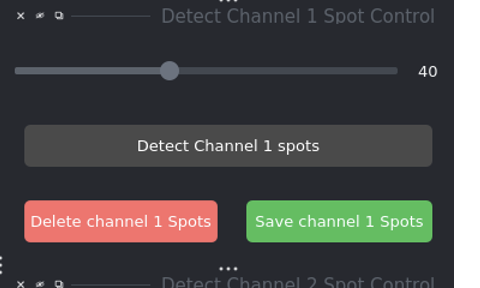
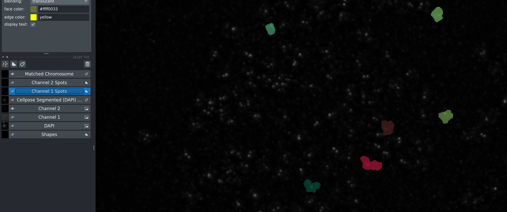

Basic Workflow
==============

This guide covers the complete single-image analysis workflow with all options and parameters.

Workflow Overview
-----------------

The basic workflow consists of seven main steps:

1. Configure channel identifiers
2. Load images
3. Segment chromosomes (optional)
4. Detect spots in both channels
5. Find common regions
6. Measure intensities
7. Export results

Each step is detailed below with all available options.

Step 1: Channel Identifier Configuration
-----------------------------------------

Before loading images, configure the channel identifiers to match your naming convention.

.. figure:: _static/images/slide_03_workflow_guide_step_1_setting_img03.png
   :alt: Channel identifier setup
   :align: center
   :width: 70%

   Channel identifier configuration panel

**Configuration Fields:**

**DAPI Channel Identifier**
   Enter the string that identifies DAPI images in your filenames.
   
   * Examples: ``435``, ``dapi``, ``DAPI``, ``w435``
   * Used for: Chromosome segmentation

**Channel 1 Identifier (DNA-FISH)**
   Enter the string that identifies DNA-FISH images.
   
   * Examples: ``525``, ``dna_fish``, ``DNA-FISH``, ``w525``
   * Used for: Primary spot detection

**Channel 2 Identifier (CENP-C)**
   Enter the string that identifies CENP-C images.
   
   * Examples: ``679``, ``cenpc``, ``CENP-C``, ``w679``
   * Used for: Secondary spot detection

**File Naming Examples:**

Match these patterns:

```
# Numeric identifiers
sample_001_w435.tif  (DAPI)
sample_001_w525.tif  (DNA-FISH)
sample_001_w679.tif  (CENP-C)

# Descriptive identifiers
cell_01_dapi.tif
cell_01_dna_fish.tif
cell_01_cenpc.tif

# Mixed format
image_435_ch1.tif
image_525_ch2.tif
image_679_ch3.tif
```

.. note::
   The identifier can appear anywhere in the filename. The software searches for the substring within each filename.

Step 2: Loading Images
-----------------------

.. figure:: _static/images/slide_04_step_2_loading_images_click_l_img04.png
   :alt: Image loading
   :align: center
   :width: 85%

   After loading images - folder list appears on the left

**To Load Images:**

1. Click the **Load Images** button
2. Navigate to your folder containing image files
3. Click **Select**

**What Happens:**

* Software searches for files matching your channel identifiers
* Matching images are loaded into the napari viewer
* Image sets appear in the folder list (left panel)
* Click any folder in the list to switch between image sets

**Skip Segmentation Option:**

.. tip::
   Check **Skip Segmentation** before loading if:
   
   * You don't have DAPI images
   * You only want to analyze spot co-localization
   * Segmentation is not needed for your analysis

When checked, the software skips Step 3 and goes directly to spot detection.

Step 3: Chromosome Segmentation
--------------------------------

.. figure:: _static/images/slide_06_slide_6_img06.jpg
   :alt: Segmentation result
   :align: center
   :width: 80%

   Segmentation output showing individual chromosomes with unique labels

**To Segment:**

Click **Segment (DAPI) Image**

**Processing:**

* Uses trained Cellpose model for metaphase chromosomes
* Automatically detects chromosome boundaries
* Creates a labels layer with unique ID for each chromosome
* Each chromosome is displayed in a different color

**Segmentation Parameters:**

The Cellpose model uses these default parameters:

* **Model**: Custom trained for metaphase chromosomes
* **Diameter**: Automatically determined
* **Channels**: [0,0] for grayscale DAPI
* **GPU**: Enabled if available

**Post-processing Options:**

Available through checkboxes (if implemented):

* **Remove small objects**: Filters out noise
* **Remove edge objects**: Excludes chromosomes touching borders
* **Fill holes**: Fills gaps within chromosomes
* **Smooth boundaries**: Applies morphological smoothing

**Typical Processing Time:**

* With GPU: 5-15 seconds
* Without GPU: 30-60 seconds

Step 4: Spot Detection
-----------------------

Detect spots in both channels using adjustable thresholds.

Adjusting Thresholds
~~~~~~~~~~~~~~~~~~~~~



   Threshold adjustment controls

**DNA-FISH Threshold Slider:**

* Range: 0-100
* Default: 50
* Lower values = more spots detected (more sensitive)
* Higher values = fewer spots detected (more specific)

**CENP-C Threshold Slider:**

* Same range and behavior as DNA-FISH
* Independently adjustable
* Optimize based on your image quality

.. important::
   Changing the slider resets detection status. You must re-run detection after adjusting thresholds.

Detecting Channel 1 Spots
~~~~~~~~~~~~~~~~~~~~~~~~~~

1. Adjust the **DNA-FISH Threshold** slider
2. Click **Detect Channel 1 Spots**
3. Wait for processing to complete

.. figure:: _static/images/slide_08_after_clicking_detect_channel__img08.png
   :alt: Channel 1 detection
   :align: center
   :width: 80%

   Channel 1 spots detected - shown as brown markers

**What You'll See:**

* New layer: "Channel 1 spots"
* Colored markers at each detected spot location
* Toggle the DNA-FISH layer to see overlay

Detecting Channel 2 Spots
~~~~~~~~~~~~~~~~~~~~~~~~~~

1. Adjust the **CENP-C Threshold** slider
2. Click **Detect Channel 2 Spots**
3. Wait for processing

.. figure:: _static/images/slide_09_do_the_same_for_channel_2_and__img09.png
   :alt: Both channels detected
   :align: center
   :width: 80%

   Both channels with detected spots

**Optimization Tips:**

* Start with default value (50)
* If too few spots: decrease threshold by 10
* If too many false positives: increase threshold by 10
* Test on a representative image before batch processing

Step 5: Finding Common Regions
-------------------------------



   Finding common regions interface

Click **Find Common** to identify overlapping signals.

**What This Does:**

* Identifies chromosomes (or regions) with both Channel 1 and Channel 2 spots
* Creates a filtered dataset of co-localized signals
* Removes background and non-overlapping signals

**Why It's Important:**

* Ensures meaningful co-localization
* Reduces false positives
* Improves quantification accuracy

**Output:**

* New layer showing common regions
* Only spots in common regions will be used for intensity measurements

Step 6: Measuring Intensities
------------------------------

Click **Get Intensity at Spots Location**

**Measurements Performed:**

* Channel 2 intensity at each Channel 1 spot location
* Channel 1 intensity at each Channel 2 spot location
* Background-subtracted values
* Spot coordinates

**CSV Output Format:**

The saved file contains columns:

* ``spot_id``: Unique identifier for each spot
* ``x_coordinate``: X position in pixels
* ``y_coordinate``: Y position in pixels
* ``channel1_intensity``: Intensity in Channel 1
* ``channel2_intensity``: Intensity in Channel 2
* ``folder_name``: Source folder
* Additional metadata

**File Location:**

* Saved in the same folder as your images
* Filename: ``<folder_name>_intensity.csv``
* Check terminal output for exact path

Step 7: Saving and Exporting
-----------------------------

**Automatic Saves:**

* CSV files are automatically saved after intensity calculation
* Naming format: ``<folder_name>_intensity.csv``

**Manual Saves:**

If you made manual corrections (see :doc:`manual_corrections`):

1. Click **Save** button
2. Corrections are stored for next time you load this image set

**Exporting Visualizations:**

To export images with overlays:

1. In Napari menu: **File → Save Selected Layer(s)**
2. Choose format (PNG recommended)
3. Select layers to export

Analysis Without Segmentation
------------------------------

For spot-only analysis (no chromosome segmentation needed):

**When to Use:**

* No DAPI channel available
* Only analyzing spot co-localization
* Chromosomes not relevant to your analysis

**Setup:**

1. Check **Skip Segmentation** before loading images
2. Load only Channel 1 and Channel 2 images
3. DAPI is ignored even if present

**Workflow:**

1. Load images (segmentation is skipped)
2. Detect Channel 1 spots
3. Detect Channel 2 spots
4. Find common regions (based on spatial proximity)
5. Measure intensities

**Differences:**

* No chromosome boundaries
* Spot detection uses entire image
* Common regions based on spot proximity, not chromosome overlap

One-Click Analysis: Run All
----------------------------

.. figure:: _static/images/slide_13_run_all_img12.png
   :alt: Run All button
   :align: center
   :width: 60%

   Run All button for automated processing

Once you've determined optimal thresholds:

1. Configure channel identifiers
2. Load images
3. Adjust both threshold sliders
4. Check/uncheck **Skip Segmentation** as needed
5. Click **Run All**

**What Happens:**

Automatically executes all steps:

* Segmentation (if not skipped)
* Channel 1 spot detection
* Channel 2 spot detection
* Find common regions
* Calculate intensities
* Save results

**Use Case:**

Perfect for processing additional images with known-good parameters.

Parameters Reference
--------------------

**Channel Identifiers:**

* DAPI identifier (string)
* Channel 1 identifier (string)
* Channel 2 identifier (string)

**Detection Thresholds:**

* DNA-FISH threshold (0-100, default: 50)
* CENP-C threshold (0-100, default: 50)

**Processing Options:**

* Skip segmentation (checkbox)
* Post-processing options (if available)

**Output Files:**

* ``<folder_name>_intensity.csv``: Main results file
* Optional: Saved segmentations and spot labels

Best Practices
--------------

**Parameter Optimization:**

1. Start with default thresholds (50)
2. Test on 2-3 representative images
3. Adjust thresholds based on results
4. Document optimal values for your imaging conditions

**Quality Control:**

* Visually inspect segmentation results
* Check spot detection for false positives/negatives
* Use manual correction tools when needed
* Save corrections for reproducibility

**Documentation:**

* Record optimal threshold values
* Note any imaging condition changes
* Keep analysis parameters with results
* Document manual corrections made

Next Steps
----------

* :doc:`batch_processing` - Process multiple images automatically
* :doc:`manual_corrections` - Refine automated results
* :doc:`advanced_features` - Explore additional features
* :doc:`troubleshooting` - Solutions to common problems

